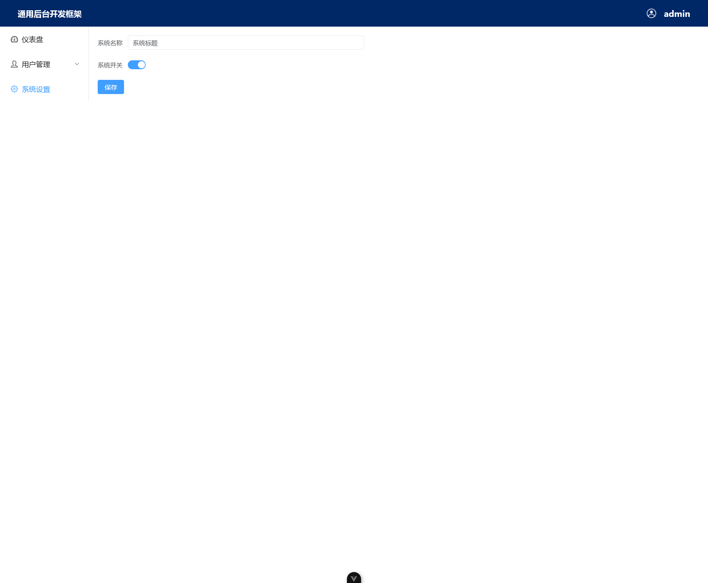

# 使用 Vue3+Vue-Router+Pinia的通用后台开发框架
## 1、特点

简单、方便、开箱即用。

正所谓斯是陋室,惟吾德馨。系统只写了一个jwt，其它功能的话，自行扩展

## 2、截图

## 注意
需要和[gin-vue-admin-framework-back](https://github.com/catcatpro/gin-vue-admin-framework-back)一起使用